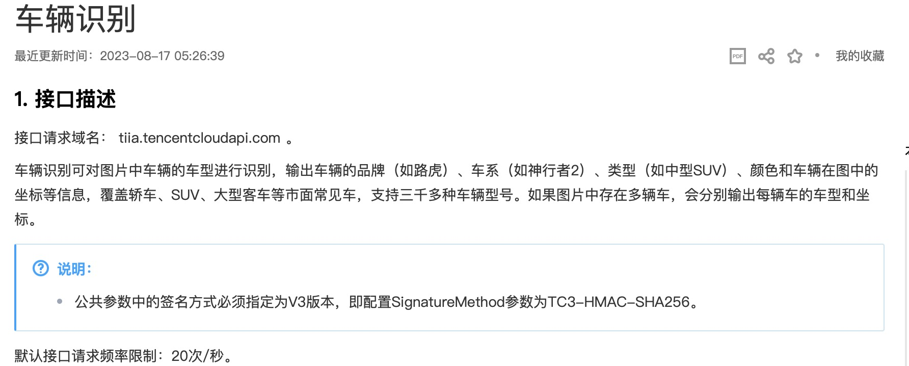
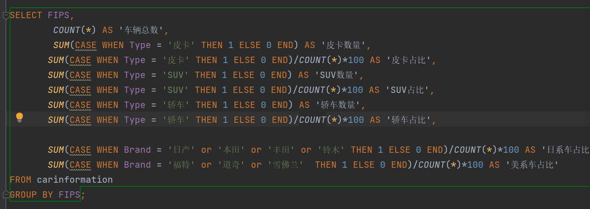
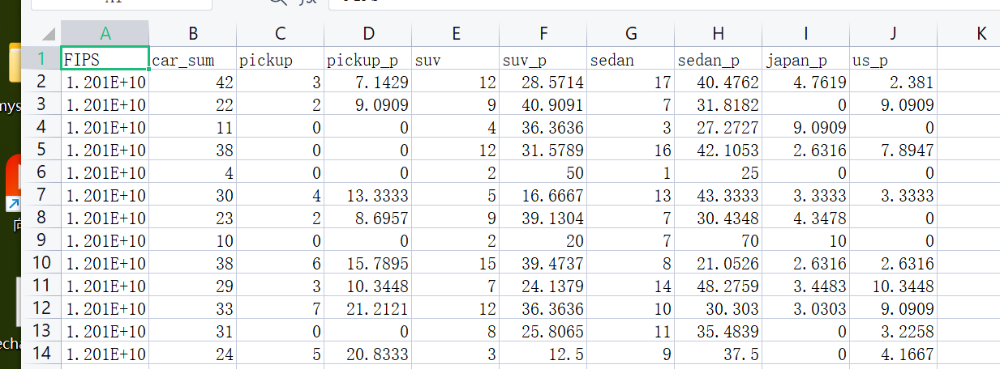

# Report

## Introduction
In this project, we try to use photos of streets to find some sociological information using machine learning methods. For example, the relationship between the number of cars in the street and the average value of property in the street, and we also have some other hypotheses, such as whether the percentage of Japanese cars in the street is related to the average education level in that street.

## Timeline

 
### Gather Information: Week1-2

### Data Collection and Analysis: Week 3-4

### Model modification and training: Week4-5

## Methodology

### Data Collection

intro: FIPS Place Codes: Used to identify cities, towns, and villages in the United States. These codes are essential for describing and analyzing geographic location information in census data.

Image source：Google Street View API

Number of pictures: 20000

Number of FIPS: 200 randomly 

Number of images per FIPS: 100

### Data Analysis and Cleaning 

intro:For all the downloaded street maps, use the API to recognize vehicles, including the number, brand, types, and series.The recognized data is stored in a database and output to a csv table after performing relevant statistical operations, including counting information such as the number of vehicles in a fips area.

Step1:use API

API: tecentcloudapi

    

Step2:store data in database

Database: MySQL

    

Step3:

    

Step4:output

    

## Model modification and training 
After seeking and analyzing the dataset,we try to use both regression model and classifiers model to discover the relationship between the amount and type of the vehicles and the median property in the certain area.

### Regression Model
For the regression model, we selected the baseline regression model and the regression model with multiple independent variables. The baseline regression model was used to discover the relationship between the amount of the vehicles and the median property in the certain area. The regression model with multiple independent variables was used to discover the relationship between vehicles series and the median property, and the relationship between vehicles types and the median property. Among them, the vehicle series refers to Japanese, American, and other series. Vehicle types refer to pickups, SUVs, sedans, and others.

#### The Baseline Regression Model
##### The num_vehicles Model
The total number of vehicles in the region is considered as the independent variable, and the median property in the region is considered as the dependent variable. The result is shown below:

    

    

#### The Regression Model with Multiple Independent Variables
##### The series_of_vehicles Model
The two independent dependent variables are the proportion of Japanese series and the proportion of American series, and  the dependent variable is the median property. The result is shown below:
div style="text-align:center;">
    

    

##### The type_of_vehicles Model
The independent dependent variables are the proportion of pickups,  SUVs and sedans, and the dependent variable is the median property.The result is shown below:
div style="text-align:center;">
    

    

### Classifier Model

#### Data Loading and Preprocessing:

The script loads two CSV files (data.csv and Florida_ct.csv) using pandas.
The data from the two DataFrames are merged based on the 'FIPS' column.
Additional columns are created based on calculations involving existing columns.
The relevant columns for the analysis are selected and stored in the test_df DataFrame.
A new column 'property_value_discrete' is created based on a threshold value for 'property_value_median'.

#### Data Splitting

The data is split into features (X) and the target variable (y). The feature set consists of selected columns, and the target variable is 'property_value_discrete'.

#### Model Training and Evaluation

A logistic regression model is instantiated, trained on the training data, and evaluated on both training and testing sets.
A list of different classifier instances is created. (adding three new models: xgboost, lightgbm, catboost)
A loop iterates through each classifier, fits it to the training data, and evaluates its performance on both training and testing sets.
Metrics such as accuracy and log loss are calculated for each classifier.

#### Visualization

The model uses seaborn and matplotlib to create bar plots for visualizing the performance of each classifier.
Two plots are generated: one showing the test accuracy of each classifier and another showing the test log loss.

#### Output
The model outputs the training and testing accuracy, as well as the training and testing log loss, for each classifier.
It also generates visualizations of classifier performance in terms of accuracy and log loss.

#### Results
##### The test accuarcy:
div style="text-align:center;">
    

##### The log loss:
div style="text-align:center;">
    

## Conclusion 

## Reference 

1. Using deep learning and Google Street View to estimate the demographic makeup of neighborhoods across the United States
2. Combining satellite imagery and machine learning to predict poverty
3. Deep hybrid models with urban imagery
4. Learning representations of satellite imagery by leveraging point of interests

## Contribution
Rongfei Zheng:data collection and anylysis

Jingcheng Wang:  Model modification and training

Junxi Wu:  Model modification and training
