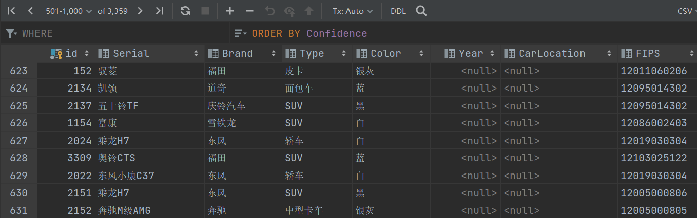

# Report

## Introduction
In this project, we try to use photos of streets to find some sociological information using machine learning methods. For example, the relationship between the number of cars in the street and the average value of property in the street, and we also have some other hypotheses, such as whether the percentage of Japanese cars in the street is related to the average education level in that street.

## Timeline

 
### Gather Information: Week1-2

### Data Collection and Analysis: Week 3-4

### Model modification and training: Week4-5

## Methodology

### Data Collection

intro: FIPS Place Codes: Used to identify cities, towns, and villages in the United States. These codes are essential for describing and analyzing geographic location information in census data.

Image source：Google Street View API

Number of pictures: 20000

Number of FIPS: 200 randomly 

Number of images per FIPS: 100

### Data Analysis and Cleaning 

intro:For all the downloaded street maps, use the API to recognize vehicles, including the number, brand, types, and series.The recognized data is stored in a database and output to a csv table after performing relevant statistical operations, including counting information such as the number of vehicles in a fips area.

Step1:use API

API: tecentcloudapi

    

Step2:store data in database

Database: MySQL

    

Step3:

    

Step4:output

    

## Model modification and training 
After seeking and analyzing the dataset,we try to use both regression model and classifiers model to discover the relationship between the amount and type of the vehicles and the median property in the certain area.

### Regression Model
For the regression model, we selected the baseline regression model and the regression model with multiple independent variables. The baseline regression model was used to discover the relationship between the amount of the vehicles and the median property in the certain area. The regression model with multiple independent variables was used to discover the relationship between vehicles series and the median property, and the relationship between vehicles types and the median property. Among them, the vehicle series refers to Japanese, American, and other series. Vehicle types refer to pickups, SUVs, sedans, and others.

#### The Baseline Regression Model
The total number of vehicles in the region is considered as the independent variable, and the median property in the region is considered as the dependent variable. The result is shown below:

    

## Conclusion 

## Reference 

1. Using deep learning and Google Street View to estimate the demographic makeup of neighborhoods across the United States
2. Combining satellite imagery and machine learning to predict poverty
3. Deep hybrid models with urban imagery
4. Learning representations of satellite imagery by leveraging point of interests

## Contribution
Rongfei Zheng:data collection and anylysis

Jingcheng Wang:

Junxi Wu:
